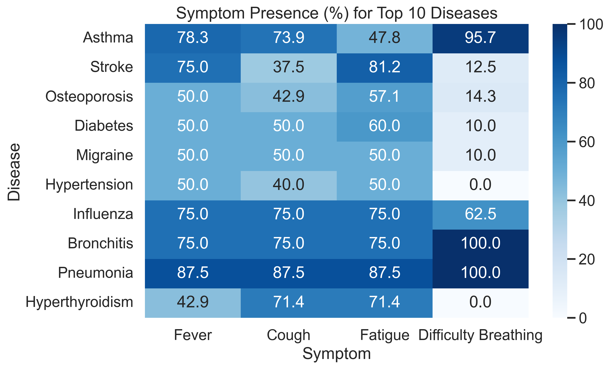
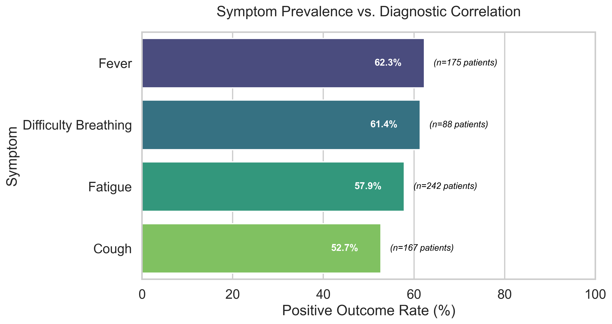
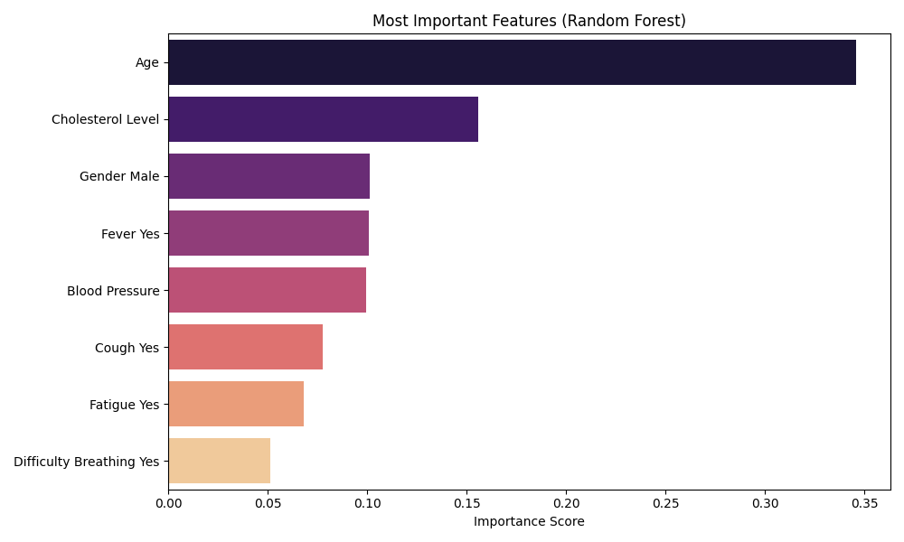

# Disease Symptoms and Patient Profile Analysis

### End-to-end exploratory analysis, visualization, and baseline machine learning modeling on a synthetic disease symptom and patient profile dataset using Python and scikit-learn.

This repository presents a structured healthcare data science workflow progressing from exploratory data analysis (EDA) and clinical visualization to interpretable baseline machine learning models for predicting patient outcomes.

The primary objective of this project is to demonstrate reproducible data analysis practices, structured preprocessing, and clear model interpretation within a healthcare-style dataset.

---

## Key Skills Demonstrated

- Data exploration and validation  
- Clinical feature interpretation  
- Visualization and analytical storytelling  
- Categorical preprocessing (One-Hot & Ordinal Encoding)  
- Machine learning pipelines with scikit-learn  
- Model evaluation and comparison  
- Basic model explainability using feature importance  

---

## Project Overview

The analysis pipeline includes:

- Dataset exploration and validation
- Symptom and disease distribution analysis
- Visualization of patient outcomes and demographics
- Correlation analysis between symptoms and outcomes
- Baseline machine learning modeling

The repository is organized as a reproducible workflow rather than a single notebook, mirroring real-world analytics projects.

---

## Repository Structure

```bash
disease_symptom_analysis_project/
│
├── data/
│   └── disease_symptom_and_patient_profile_dataset.csv
│
├── figures/
│   ├── 01_outcome_distribution.png
│   ├── 02_top10_diseases_pie.png
│   ├── 03_top10_disease_outcome_percentage.png
│   ├── 04_symptoms_by_disease_percent.png
│   ├── 05_symptom_impact.png
│   ├── 06_outcome_by_age_group.png
│   └── 07_feature_importance.png
│
├── notebooks/
│   ├── 01_exploration_cleaning.py
│   ├── 02_analysis_visualization.py
│   └── 03_modeling_baseline.py
│
├── README.md
└── requirements.txt
```

Scripts inside the `notebooks/` directory are organized sequentially and can be executed in order to reproduce the full workflow.

---

## Data Exploration Summary

The dataset contains 349 patient records including demographic and clinical indicators.

Key characteristics:
- Binary outcome variable (Positive / Negative)
- Balanced target distribution (~53% Positive, ~47% Negative)
- Symptom indicators (Fever, Cough, Fatigue, Difficulty Breathing)
- Demographic information (Age, Gender)
- Clinical indicators (Blood Pressure, Cholesterol Level)

No missing values were detected.

Duplicate rows were identified but intentionally retained. In small synthetic healthcare-style datasets, identical symptom profiles may represent different individuals rather than data entry errors.

---

## Visualization Summary

The visual analysis explores relationships between symptoms, diseases, demographics, and outcomes.

Key observations:
- Outcomes are relatively balanced, supporting meaningful model training.
- Asthma and Stroke are among the most frequent diseases in the dataset.
- Symptom prevalence varies significantly across diseases.
- Fever and Difficulty Breathing show the strongest association with Positive outcomes.
- While individual symptoms provide meaningful signals visually, demographic and systemic clinical indicators (like Age and Cholesterol) ultimately provide the strongest baseline for predictive modeling.

---

## Example Visualizations

### Symptom Presence (%) by Top 10 Diseases


### Symptom Prevalence vs. Diagnostic Correlation


---

## Technologies Used

- Python
- pandas
- seaborn
- matplotlib
- scikit-learn

---

## Modeling Baseline

Two baseline classifiers were trained to predict the **Outcome Variable**:

- Logistic Regression
- Random Forest

Results:

- **Logistic Regression:** ~64% accuracy
- **Random Forest:** ~77% accuracy

Logistic Regression captures baseline linear relationships between symptoms and outcomes.

Random Forest improves performance by identifying nonlinear interactions between demographic and clinical features.

### Feature Importance Analysis

Tree-based models successfully identified that demographic and systemic health indicators are significantly more predictive than individual symptoms alone.



- **Age** is the most dominant predictor with an importance score of 0.34.
- **Cholesterol Level** is the second most critical feature, highlighting the importance of systemic health metrics.

---

## Project Goals

This project emphasizes:
- Building structured and reproducible healthcare analysis workflows
- Interpreting feature relationships within a clinical-style dataset
- Demonstrating baseline modeling with clear evaluation and explainability

The focus is on analytical reasoning and workflow design rather than maximizing predictive performance.

---

## Future Improvements

Potential extensions of this project include:

- K-fold cross-validation for more robust evaluation
- ROC curve and probability-based performance metrics
- Hyperparameter tuning
- Testing the pipeline on real-world healthcare datasets

---