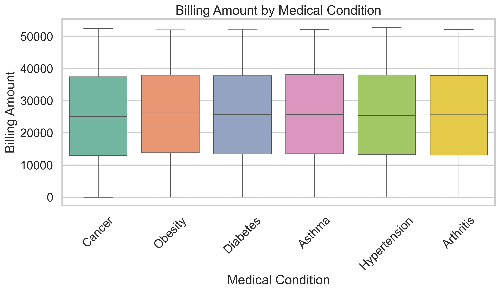
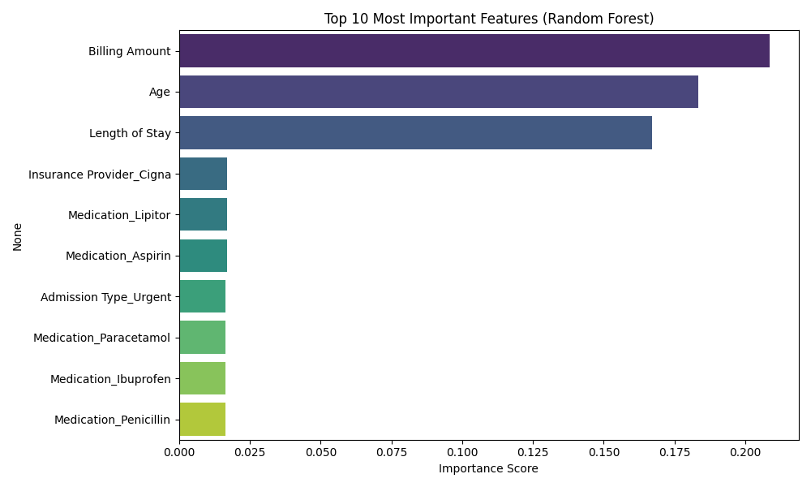

# Healthcare Data Analysis Project

### End-to-end exploratory analysis, visualization, and baseline modeling on a synthetic healthcare dataset using Python and scikit-learn.

The dataset is fully synthetic and was generated for educational purposes.
Therefore, strong real-world relationships between variables are not expected, and modeling results should be interpreted accordingly.

---

## Key Skills Demonstrated

- **Data Audit & Cleaning**: Identifying logical date errors and filtering unrealistic values.
- **Feature Engineering**: Deriving time-based and binned categorical features.
- **Advanced Visualization**: Using normalized percentage plots to compare unbalanced classes.
- **ML Pipelines**: Building scalable `scikit-learn` pipelines with automated scaling and encoding.
- **Model Intuition**: Feature selection and removal of non-informative identifiers (e.g., Room Number) to prevent data leakage and overfitting.

---

## Repository Structure

```bash
healthcare_analysis_project/
│
├── data/
│   ├── healthcare_dataset.csv
│   └── healthcare_dataset_clean.csv
│
├── figures/
│   ├── 01_billing_by_condition.png
│   ├── 02_age_by_condition.png
│   ├── 03_los_by_admission_type.png
│   ├── 04_test_results_by_admission_type.png
│   ├── 05_billing_by_insurance.png
│   ├── 06_test_results_by_age_group.png
│   ├── 07_admission_type_by_billing_category.png
│   └── 08_feature_importance.png
│
├── notebooks/
│   ├── 01_exploration_cleaning.py
│   ├── 02_analysis_visualizations.py
│   └── 03_modeling_baseline.py
│
├── README.md
└── requirements.txt
```
Scripts inside the `notebooks/` directory are organized sequentially and can be executed in order to reproduce the full workflow.

---

## Data Cleaning & Feature Engineering

The following preprocessing steps were performed:

- Converted admission and discharge dates to datetime format
- Created a **Length of Stay** feature
- Removed exact duplicate records
- Filtered unrealistic negative billing values
- Generated derived features such as **Age Group** and **Billing Category**

---

## Visualization Summary

Because the dataset is synthetically generated, most variables appear statistically independent.
Visualizations show largely overlapping distributions across medical conditions, admission types, and demographic groups, indicating weak statistical separation between classes.

Key observations:

- Billing costs remain similar across medical conditions
- Age distributions are consistent between patient groups
- Length of stay varies slightly but shows strong overlap across admission types
- Test result proportions remain balanced across categories

These outcomes reflect the synthetic nature of the dataset rather than clinical causality.

---

## Example Visualizations

### Billing Amount by Medical Condition


### Feature Importance (Random Forest)


---

## Technologies Used

- Python
- pandas
- seaborn
- matplotlib
- scikit-learn

---

## Modeling Baseline

Two baseline classifiers were trained to predict **Test Results**:

- Logistic Regression
- Random Forest

Results:

- **Logistic Regression accuracy**: ~33%
- **Random Forest accuracy**: ~43%

In a three-class classification problem, random guessing would yield approximately 33% accuracy. Logistic Regression performs near this baseline, while Random Forest captures limited nonlinear patterns but overall predictive signal remains weak.

Feature importance analysis suggests that continuous variables such as **Billing Amount** and **Age** contribute more to predictions than categorical attributes, although overall predictive signal remains weak.

These findings are consistent with exploratory analysis and confirm that the dataset contains limited underlying structure due to its synthetic origin.

The primary goal of this modeling step is to demonstrate pipeline design, preprocessing workflows, and evaluation methodology rather than achieving high predictive performance.

---

## Limitations

This dataset is synthetic and does not reflect real clinical relationships. Therefore:
- Observed patterns may not generalize to real healthcare data
- Predictive performance is constrained by the artificial nature of the data
- Modeling results should be interpreted as methodological demonstrations rather than clinical insights

---

## Future Improvements

Possible extensions of this project include:
- Testing additional classification algorithms
- Cross-validation and model comparison with additional metrics
- Performing hyperparameter tuning
- Applying the same pipeline to real-world healthcare datasets
- Expanding evaluation with ROC curves and precision–recall analysis