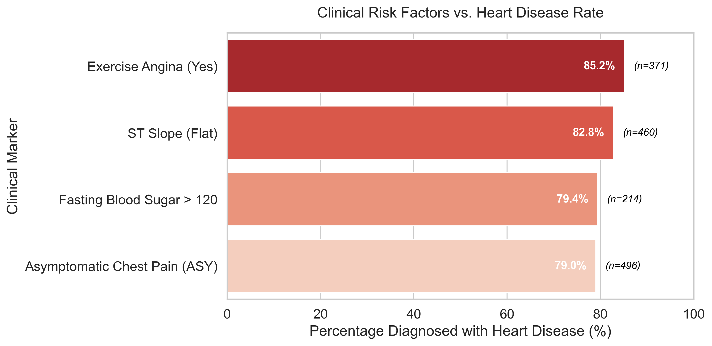
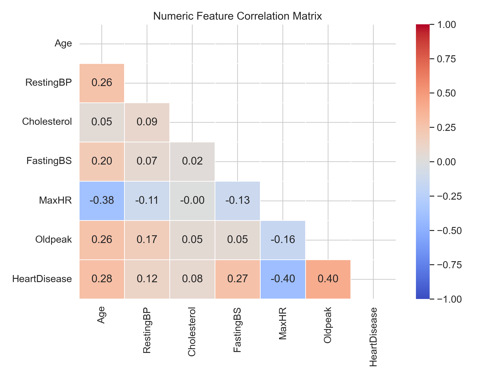
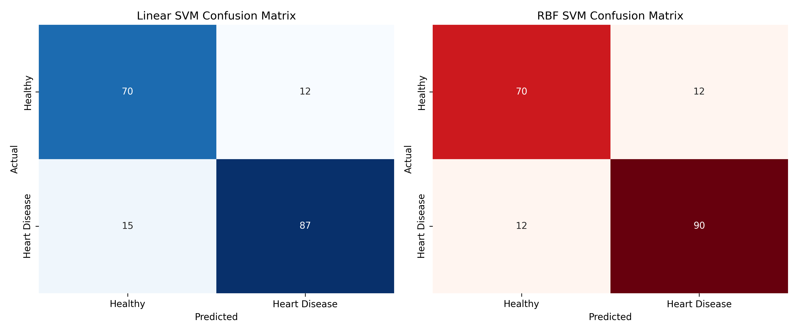
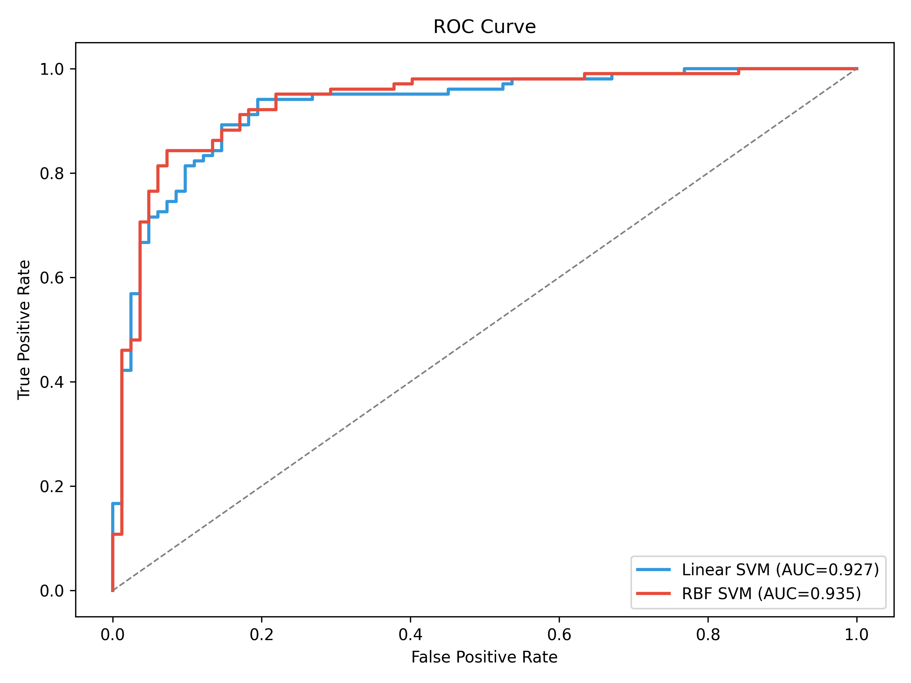

# Heart Failure Clinical Prediction and Geometric Modeling

### End-to-end exploratory analysis, clinical risk visualization, and geometric machine learning modeling (SVM) on a heart failure dataset using Python and scikit-learn.

This repository presents a structured healthcare data science workflow progressing from advanced exploratory data analysis (EDA) to robust machine learning pipelines. 

The primary objective of this project is to demonstrate strict data preprocessing without data leakage, evaluate complex clinical feature interactions, and compare linear vs. non-linear geometric algorithms (Support Vector Machines) using advanced medical evaluation metrics like ROC and Precision-Recall curves.

---

## Key Skills Demonstrated

- Data cleaning and preprocessing
- Exploratory data analysis (EDA) and visualization
- Clinical data interpretation using plots
- Feature preprocessing (One-Hot Encoding and Standard Scaling)
- Machine learning using Support Vector Machine (SVM)
- Building preprocessing and modeling pipelines with scikit-learn
- Model evaluation using accuracy, ROC curve, and confusion matrix

---

## Project Overview

The analysis pipeline includes:

- Dataset exploration and biological validation  
- Clinical risk distribution analysis  
- Visualization of patient demographics and diagnostic indicators  
- Correlation analysis between clinical measurements and disease outcome  
- Leakage-free machine learning modeling using preprocessing pipelines  
- Linear and nonlinear Support Vector Machine modeling  

The repository is organized as a reproducible workflow rather than a single notebook, mirroring real-world clinical analytics projects.

---

## Repository Structure

```bash
heart_failure_prediction_project/
│
├── data/
│   ├── heart_failure_dataset.csv
│   └── heart_failure_dataset_clean.csv
│
├── figures/
│   ├── 01_heart_disease_distribution.png
│   ├── 02_heart_disease_by_age_group.png
│   ├── 03_heart_disease_by_sex.png
│   ├── 04_chest_pain_stacked.png
│   ├── 05_cholesterol_distribution.png
│   ├── 06_clinical_risk_profile.png
│   ├── 07_numeric_violin_grid.png
│   ├── 08_exercise_angina_numeric.png
│   ├── 09_fastingbs_stacked.png
│   ├── 10_feature_correlation.png
│   ├── 11_svm_confusion_matrices.png
│   ├── 12_svm_roc_curve.png
│   └── 13_svm_precision_recall_curve.png
│
├── notebooks/
│   ├── 01_exploration_cleaning.py
│   ├── 02_analysis_visualization.py
│   └── 03_modeling_baseline.py
│
├── README.md
└── requirements.txt
```

Scripts inside the `notebooks/` directory are organized sequentially and can be executed in order to reproduce the full workflow.

---

## Data Exploration Summary

The dataset contains 918 patient records including demographic, symptomatic, and clinical indicators.

Key characteristics:
- Binary outcome variable (Heart Disease: Positive / Negative)
- Demographic information (Age, Sex)
- Clinical measurements (Cholesterol, Resting Blood Pressure, Maximum Heart Rate, Oldpeak)
- Diagnostic indicators (Chest Pain Type, Exercise Angina, Fasting Blood Sugar)

Data cleaning identified biologically impossible values such as Cholesterol = 0 and RestingBP = 0. These values were corrected using median imputation to restore physiologically realistic distributions.

Negative Oldpeak values were preserved, as they represent valid clinical measurements.

---

## Visualization Summary

The visual analysis explores relationships between clinical features, demographics, and heart disease outcome.

Key observations:
- Heart disease prevalence increases significantly with age.
- Male patients show substantially higher disease prevalence than female patients.
- Asymptomatic chest pain type (ASY) is strongly associated with heart disease.
- Patients with exercise-induced angina show significantly higher disease rates.
- Patients with heart disease generally exhibit lower Maximum Heart Rate and higher Oldpeak values.

Overall, the visualizations demonstrate that exercise response indicators and chest pain characteristics provide the strongest predictive signal for heart disease.

---

## Example Visualizations

### Clinical Risk Profile by Diagnostic Indicators


### Feature Correlation Heatmap


---

## Technologies Used

- Python
- pandas
- seaborn
- matplotlib
- scikit-learn

---

## Modeling Baseline

Two geometric classifiers were trained to predict the Heart Disease Outcome Variable:

- Linear Support Vector Machine
- RBF Kernel Support Vector Machine

Results:

- Linear SVM: 85.3% accuracy | ROC AUC: 0.927
- RBF SVM: 87.0% accuracy | ROC AUC: 0.935

The Linear SVM captures linear separability between clinical features and disease outcome.

The RBF SVM improves performance by modeling nonlinear relationships between physiological indicators and heart disease risk.

## Model Evaluation Visualizations

### Confusion Matrix Comparison 
 

### ROC Curve Comparison 


---

## Project Goals

This project emphasizes:
- Building structured and reproducible clinical data analysis workflows
- Applying biologically informed data preprocessing
- Demonstrating leakage-free machine learning pipelines
- Understanding geometric machine learning models in healthcare contexts
- Interpreting clinical feature relationships through visualization and modeling

The focus is on analytical rigor, reproducibility, and proper machine learning methodology rather than maximizing predictive performance.

---

## Future Improvements

Potential extensions of this project include:

- Hyperparameter tuning using GridSearchCV
- Optimization of Support Vector Machine hyperparameters (C and gamma)
- Cross-validation for more robust performance estimation
- Feature selection and dimensionality reduction
- Comparison with tree-based and ensemble models
- Calibration analysis for clinical probability interpretation

---