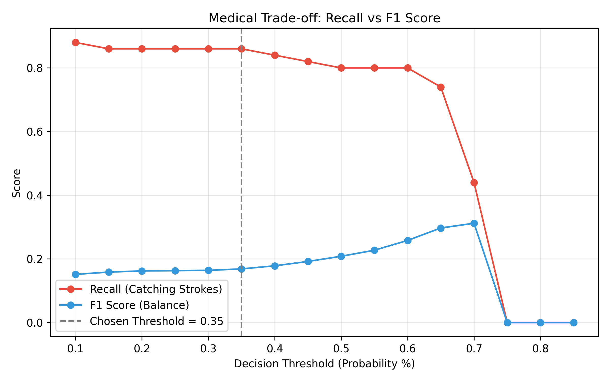
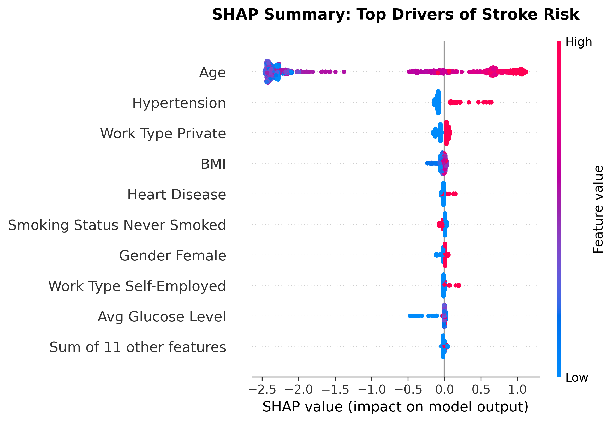
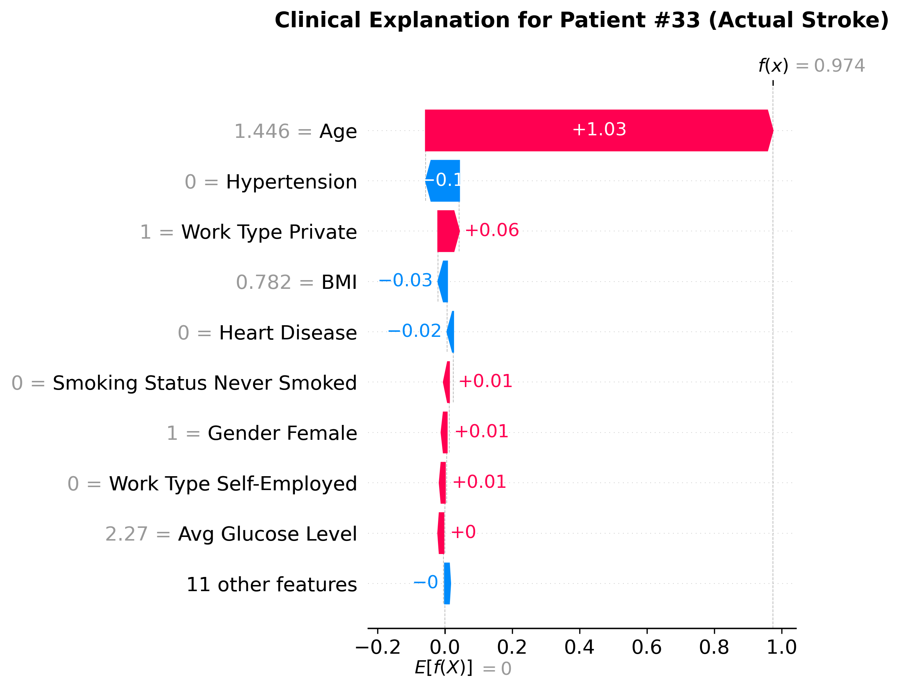

# Stroke Risk Prediction: Clinical Threshold Optimization and Explainable Gradient Boosting

### End-to-end clinical data analysis, imbalanced learning, threshold optimization, and interpretable XGBoost modeling for stroke risk prediction.

This repository presents a structured healthcare machine learning workflow progressing from rigorous data quality control and exploratory data analysis to clinically optimized and interpretable modeling using gradient boosting.

The primary objective of this project is not merely to predict stroke occurrence, but to:

- Apply strict leakage-free preprocessing  
- Handle severe class imbalance (~5% stroke prevalence)  
- Optimize decision thresholds using clinically informed rules  
- Provide transparent model explanations using SHAP  

The emphasis is methodological rigor, reproducibility, and biological plausibility.

---

## Key Skills Demonstrated

- Clinical data cleaning and quality control
- Exploratory data analysis with biological signal validation
- Feature preprocessing (Standard Scaling + One-Hot Encoding)
- Leakage-free machine learning pipelines (scikit-learn + imbalanced-learn)
- Class imbalance handling using SMOTE
- Gradient boosting modeling (XGBoost) with hyperparameter tuning
- Clinical threshold optimization (Recall-constrained decision rule)
- Evaluation using ROC-AUC, Precision, Recall, F1-score, Confusion Matrix
- Model interpretability using SHAP (global and patient-level explanations)

---

## Repository Structure

```bash
stroke_prediction_project/
│
├── data/
│   ├── stroke_dataset.csv
│   └── stroke_dataset_clean.csv
│
├── figures/
│   ├── 01_stroke_distribution.png
│   ├── 02_stroke_rate_by_gender.png
│   ├── 03_age_distribution_kde.png
│   ├── 04_vitals_kde.png
│   ├── 05_clinical_risk_factors.png
│   ├── 06_correlation_heatmap.png
│   ├── 07_feature_correlation_with_stroke.png
│   ├── 08_roc_curve_tuned_xgboost.png
│   ├── 09_threshold_vs_recall_f1.png
│   ├── 10_shap_summary.png
│   └── 11_shap_waterfall.png
│
├── notebooks/
│   ├── 01_exploratory_cleaning.py
│   ├── 02_analysis_visualization.py
│   ├── 03_modeling_baseline.py
│   ├── 04_modeling_tuned.py
│   ├── 05_threshold_optimization.py
│   └── 06_shap_explainability.py
│
├── README.md
└── requirements.txt
```

All scripts are sequentially organized and can be executed in order to reproduce the full workflow.

---

## Data Exploration & Quality Control

The dataset contains **5,110 patient records** with demographic, lifestyle, and clinical indicators.

### Class Distribution

- Stroke cases: 249 (~5%)
- Non-stroke cases: 4,861 (~95%)

This severe imbalance requires specialized modeling strategy.

### Data Quality Measures

- 201 missing BMI values were imputed using median imputation.
- A single anomalous biological gender record was removed.
- Feature distributions were validated against known biological expectations.

### EDA Findings

- Stroke incidence rises sharply after age 60.
- Hypertension and heart disease substantially elevate stroke risk.
- Elevated glucose levels correlate with higher stroke prevalence.
- BMI alone shows weak standalone predictive signal.

---

## Handling Class Imbalance

Naive models achieve ~95% accuracy by predicting "No Stroke" for all patients, which is clinically useless.

To address this:

- SMOTE was applied **only to the training set** within an imblearn pipeline.
- The test set remained untouched to prevent data leakage.
- Evaluation focused on Recall and ROC-AUC rather than raw accuracy.

This preserves realistic generalization performance.

---

## Modeling Strategy

Multiple baseline classifiers were evaluated (KNN, SVM, XGBoost).

XGBoost was selected for its ability to capture nonlinear feature interactions while maintaining robustness.

### Optimized Hyperparameters

- max_depth = 3  
- learning_rate = 0.01  
- n_estimators = 200  
- subsample = 1.0  
- colsample_bytree = 1.0  

### Performance

- ROC-AUC: **0.8245**

The model captures meaningful clinical signal while avoiding deep-tree overfitting.

---

## Clinical Threshold Optimization

Standard ML defaults to a 0.50 probability threshold.  
In clinical screening, minimizing false negatives (missed strokes) is critical.

A clinical decision rule was applied:

> Select the highest probability threshold that maintains ≥ 85% stroke recall.

### Selected Threshold: 0.35

Results:

- True Positives: 43 / 50
- Recall (Sensitivity): 0.86
- False Positives: 417

This explicitly prioritizes safety (high sensitivity) over precision, aligning with real-world diagnostic strategy.

### Threshold Trade-off Visualization


The recall curve remains stable until ~0.35 before dropping sharply.  
The selected threshold sits at the edge of this plateau.

---

## Model Explainability with SHAP

To ensure transparency and clinical interpretability, SHAP (SHapley Additive exPlanations) was applied.

### 1️⃣ Global Interpretation (Population-Level)



Findings:

- **Age** is the dominant predictive driver.
- Hypertension significantly increases risk.
- Elevated glucose contributes positively to stroke probability.
- Low-risk profiles actively reduce model output.

The learned feature relationships align with established stroke epidemiology.

---

### 2️⃣ Local Interpretation (Patient-Level)



The waterfall plot decomposes an individual stroke prediction into feature-level contributions.

Each red bar increases predicted risk, blue bars reduce it.

This enables patient-specific reasoning and model auditability.

---

## Technologies Used

- Python (pandas, numpy)
- scikit-learn
- imbalanced-learn
- XGBoost
- SHAP
- matplotlib / seaborn

---

## Project Goals

This project emphasizes:

- Structured and reproducible ML workflows
- Leakage-free preprocessing
- Responsible handling of imbalanced medical data
- Clinically informed decision threshold selection
- Transparent and biologically coherent model interpretation

The focus is methodological correctness and interpretability rather than maximizing raw accuracy.

---

## Future Improvements

- Cross-validation for threshold stability
- Probability calibration (Platt scaling / isotonic regression)
- Cost-sensitive learning as alternative to SMOTE
- External dataset validation
- Deployment as a clinical decision-support interface

---